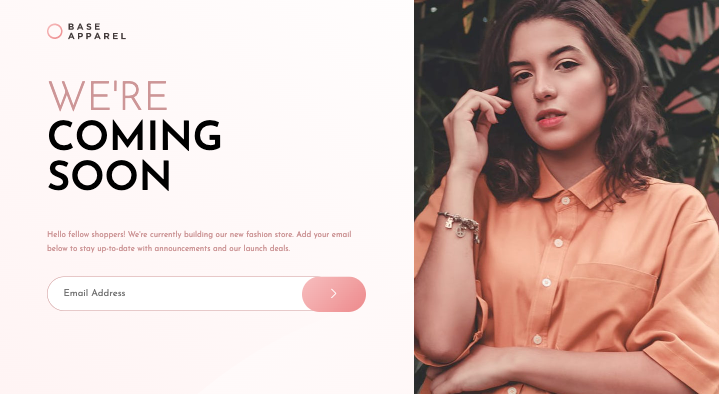

# Frontend Mentor - Base Apparel coming soon page


## Table of contents

- [Overview](#overview)
  - [The challenge](#the-challenge)
  - [Screenshot](#screenshot)
  - [Links](#links)
- [My process](#my-process)
  - [Built with](#built-with)
  - [What I learned](#what-i-learned)
- [Author](#author)


## Overview

### The challenge


Users should be able to:

Users should be able to:

- View the optimal layout for the site depending on their device's screen size
- See hover states for all interactive elements on the page
- Receive an error message when the `form` is submitted if:
  - The `input` field is empty
  - The email address is not formatted correctly

### Screenshot




### Links

- Live Site URL: [Live Demo](https://cute-raindrop-7c0b19.netlify.app)

## My process

### Built with

- Semantic HTML5 markup
- CSS custom properties
- Flexbox
- Desktop-first workflow


### What I learned
- Basic Understanding of BEM Naming

- JS RegExp

``` js
const emailValidation = /^\w+([\.-]?\w+)*@\w+([\.-]?\w+)*(\.\w{2,3})+$/;

```


## Author
- Frontend Mentor - [@Master-Osaro](https://www.frontendmentor.io/profile/yourusername)
- Twitter - [@iyoha_osaro](https://www.twitter.com/yourusername)
